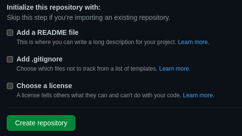

*Ik heb ooit eens een exotisch uitstapje gemaakt naar Gitlab. Gitlab bood veel waar ik toen geïnteresseerd in was. GitHub had het op zich ook wel, alleen was het daar nèt anders. De afgelopen maanden, bij mijn nieuwe werkgever [Kingscode](https://www.kingscode.nl), heb ik intensief gebruik gemaakt van GitHub waarbij alle zaken waarom ik naar Gitlab overgestapt was, al in het proces zaten. Inmiddels heb ik dit proces zo in de vingers dat GitLab zijn charme verloren heeft. Daarnaast vind ik het vervelend om met GitLab te werken op mobiel. Wat doe je dan? **Overstappen**.*

## Zorg voor een GitHub repository

Hoe stap je eigenlijk over? Dat kan op meerdere manieren. Ik heb het als volgt gedaan.

Allereerst maak je een GitHub repository aan.

Ga naar [GitHub.com](https://www.github.com) en zorg dat je aangemeld bent.

Klik vervolgens op "Your repositories", in het menu rechtsboven (dit menu moet je open klikken door op jouw avatar te klikken).


Op de volgende pagina, zie de knop "New". Door hier op te klikken, zal het formulier verschijnen waarmee je een GitHub repository kan aanmaken.


Ik laat alle instellingen vaak staan zoals ze zijn, het enige wat ik invul, is de repository naam. Let op, wanneer je een vinkje aanzet bij een combobox onder de kop "Initialize this repository with"



De repository is nu aangemaakt.

## Overschrijf de origin van je bestaande repository

Het volgende staat eigenlijk letterlijk als stap bij de reeds aangemaakte repository onder de kop "**…or push an existing repository from the command line**". Hierbij wordt er wel van uitgegaan dat Git al geïnstalleerd is op het systeem. Is dat niet het geval, installeer het dan eventueel door het installatiebestand te downloaden van [Git - download](https://git-scm.com/downloads)

Wanneer Git beschikbaar is op het systeem, ga dan naar de terminal van jouw systeem.
* Als je Windows hebt, heb je Powershell nodig. Je kan hiernaar zoeken via Start.
  


* Voor Mac, open Finder en zoek op "Terminal".


* Mocht je een linux systeem gebruiken, dan ga ik ervan uit dat je leeft in Terminal. Zo niet, zoek naar terminal in jouw toepassingen venster.


Ga (in powershell of terminal) naar werkmap waarin jouw applicatie staat en voer de volgende commando's uit:

**De commit geschiedenis van je vorige repository blijft aanwezig!**

```bash
git remote rm origin
git remote add origin https://github.com/<JOUW GITHUB NAAM HIER>/<JOUW REPOSITORY NAAM HIER>.git
git branch -M main
git push -u origin main
```

Ga nu naar GitHub en aanschouw jouw nieuwe repository mét jouw applicatie codebase.
<br>
<br>
<br>
Bedankt voor het lezen! Ik snap dat je dit niet vaak zal doen, maar mocht het toch eens voorkomen, dan weet je nu hoe.

Mocht je vragen hebben, dan mag je die mij natuurlijk stellen! Je kunt ze stellen door een e-mail te sturen naar [me@jvh.one](mailto:me@jvh.one) of door te reageren op deze Tweet: 

Ga nu naar GitHub en aanschouw jouw nieuwe repository mét jouw applicatie codebase.
<br>
<br>
<br>
Bedankt voor het lezen! Ik snap dat je dit niet vaak zal doen, maar mocht het toch eens voorkomen, dan weet je nu hoe.
