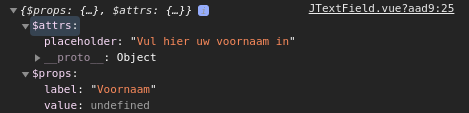

---

[format:off]: <> ( @formatter:off)
title: 'Props voor gevorderden, attribute inheritance'
date: '2021-01-31' 
published: true
tags: ['vue', 'vue2','attribute', 'props', 'inheritance', 'inheritAttrs', '$attrs']
canonical_url: false 
description: 'De optie inheritAttrs en de $attrs eigenschap. Hoe, wanneer en waarom gebruiken?'
cover_image: './assets/images/crissy-jarvis-gdL-UZfnD3I-unsplash.jpg' 
cover_credit: '© [Crissy Jarvis](https://unsplash.com/photos/gdL-UZfnD3I)'
tweet: '1355859613896355841'
[format:on]: <> (@formatter:on)
---

import JTextField from './components/JTextField' 
import JTextFieldAttrs from './components/JTextFieldAttrs' 
import JTextFieldInheritAttrs from './components/JTextFieldInheritAttrs'

*Ik kom het de laatste tijd vaak tegen. En ergens diep, heel diep in de donkere krochten van de **Vue v2.x**
documentatie … vinden we er iets over... **$attrs** *

*En wel onder het kopje, Props > Non props attributes > Disabling attribute inheritance. Maar... Wat is het? Wanneer
gebruik je het? En waarom bestaat het?*

## De Vue (v2.x) documentatie

In vier zinnen, met ieder wel een code voorbeeld, wordt deze feature uitgelegd:
> If you do not want **the root element of a component** to **inherit attributes**, you can set inheritAttrs: false in **the component’s options**  
> ...  
> This can be especially useful in combination with **the $attrs instance property**, which contains **the attribute names and values** passed to a component  
> ...  
> **With inheritAttrs: false and $attrs, you can manually decide which element you want to forward attributes to**, which is often desirable for base components  
> ...  
> Note that **inheritAttrs: false option does not affect style and class bindings**.
>
> This pattern allows you to use base components more like raw HTML elements, without having to care about which element is actually at its root  
> ...

Ik heb het enkele keren moeten lezen... Zijn dit niet gewoon props?

## Dus … Wat staat er nou eigenlijk?

Ik zal de belangrijkste zaken toelichten. Ik ga er hierbij van uit dat je bekend bent met de basis van Vue.

### The root element (of a component)

Wat is *"the root element"* van [een (Vue) component](/vue-components)?

Tussen de template-tags (`<template>...</template>`), mag één element staan, met eventueel meerdere elementen als
children. Doe je dit niet (zoals in het codevoorbeeld hieronder), dan krijg je de
foutmelding: `Component template should contain exactly one root element. If you are using v-if on multiple elements, use v-else-if to chain them instead. `

```vue

<template>
  <!-- element 1 -->
  <div class="text-field">
    <!-- child element 1 -->
    <label class="label">
      Voornaam
    </label>
    <!-- child element 2 -->
    <input class="input" type="text"/>
  </div>
  <!-- element 2 -->
  <div class="text-field">
    <!-- child element 1 (of element 2)-->
    <label class="label">
      Achternaam
    </label>
    <!-- child element 2 (of element 2) -->
    <input class="input" type="text"/>
  </div>
</template>
```

Je kunt het voorbeeld hierboven op meerdere manieren corrigeren. Zo kun je ervoor kiezen om de text-fields te "wrappen"
met een div-element. De div, met class input-fields, binnen de template-tags, is dus in dit geval *"the root element"*.

```vue

<template>
  <!-- wrapper (div-element) -->
  <div class="input-fields">
    <div class="text-field">
      <label class="label">
        Voornaam
      </label>
      <input class="input" type="text"/>
    </div>

    <div class="text-field">
      <label class="label">
        Achternaam
      </label>
      <input class="input" type="text"/>
    </div>
  </div>
</template>
```

### The component’s options

[Een (Vue) component](/vue-components) kan op meerdere manieren opgezet worden. Dit doe je door de opties van de
component in te stellen. Deze opties stel je in, in de export van het script gedeelte. Enkele bekende opties zijn *name*
, *data*, *props*, *computed*, *methods*. Er zijn er nog meer, maar die opties vallen buiten het onderwerp van deze
blog. Het opzetten van de opties, ziet er doorgaans als volgt uit:

```vue

<script>
export default {
  name: 'ComponentName',
  data() {
    return { value: '' }
  },
  props: { label: '' },
  methods: {
    myMethod(args) {
      // do stuff....
    }
  },
  computed: {
    myComputed() {
      // do stuff....
    }
  },
};
</script>
```

### Inherit attributes

Alle eigenschappen die meegegeven zijn aan een component of een element, noemen we attributen. Wanneer deze attributen
verwacht worden in de component, doordat ze zijn opgenomen in de props
van [the component options](#the-components-options), dan noemen we deze attributen *props* (properties). Als ze niet
opgenomen zijn in [the component options](#the-components-options), dan zijn het *non-prop attributes*.

De *non-prop attributes* worden standaard doorgegeven (of overgeërfd)
aan [the root element](#the-root-element-of-a-component), dit wordt **inherit attributes** genoemd.

#### Props en non-props

Om *props* en *non-props* toe te lichten, heb ik (met in het achterhoofd het [DRY principle](/dry-principle)) van het
code-voorbeeld bij [The root element (of a component)](#the-root-element-of-a-component)
, [een los (Vue) component](/vue-components) gemaakt, namelijk, **JTextField**. Dit is
een [Single File Component](/vue-components#single-file-components) en dit component ziet er als volgt uit (inclusief de
bijbehorende code):

###### components/JTextField.vue

<JTextField label="Voornaam" placeholder="Vul hier uw voornaam in" /> 

```vue

<template>
  <div class="text-field">
    <label class="label">
      {{ label }}
    </label>
    <input class="input"
           type="text"
           :value="value"
           @input="$emit('input', $event.target.value)"
    />
  </div>
</template>

<script>
export default {
  name: 'JTextField',
  props: {
    label: {
      type: String,
      required: true,
    },
    value: { type: String },
  },
}
</script>

<style lang="scss" scoped>
.text-field {
  display:         flex;
  flex-direction:  column;
  justify-content: flex-start;
  max-width:       250px;
  margin:          8px 0
}

.label {
  display:     flex;
  font-weight: 300;
  text-align:  left;
}

.input {
  border:  1px solid #669900;
  display: flex;
  padding: 8px;
  width:   100%;
}
</style>
```

Je kan zien dat de component `JTextField` de volgende props kent: `label` en `value`, waarbij label vereist is.

Dit component zou ergens anders als volgt gebruikt kunnen worden: `<JTextField label="Voornaam" />`. Je ziet dat hierbij
label als attribute wordt meegegeven en dit attribute is een **prop**.

Het volgende zou ook kunnen: `<JTextField label="Voornaam" placeholder="Vul hier uw voornaam in" />`. In dat geval is "
placeholder" een **non-prop attribute** -- "placeholder" is namelijk **niet opgenomen** in de props van de opties van de
component. Placeholder is voor het input-element (`<input />`) in het component **JTextField.vue** een geldig attribute,
alleen *de "placeholder" attribute* wordt niet geërfd door het input-element, want het input-element is
niet "[the root element (of a component)](#the-root-element-of-a-component)". Dat is uiteindelijk wel de bedoeling en
daarvoor hebben `$attrs` nodig.

### The $attrs instance property

In [een (Vue) component](/vue-components) is, binnen [the component options](#the-components-options) en binnen alle
data-bindings van de template, `$attrs` beschikbaar.

`$attrs` is een 'normaal' JavaScript object. Voor de volledigheid, hetzelfde geldt voor $props. Dat kun je zien door het
te loggen (console.log) in de opties van een component (bijvoorbeeld in de *created* lifecycle).

```vue

<script>
export default {
  // ...
  created() {
    console.log({
      $props: this.$props,
      $attrs: this.$attrs,
    })
  },
  // ...
}
</script>
```

Wanneer er bij JTextField de waarde "Voornaam" als label (prop) wordt ingegeven en bij placeholder "Vul hier uw naam
in" (`<JTextField label="Voornaam" placeholder="Vul hier uw voornaam in" />`), toont de console het volgende:



Je ziet dat `placeholder` onder `$attrs` valt (*non-prop*), en dat `label` en `value` onder $props vallen.

### With inheritAttrs: false and $attrs, ... you want to forward attributes to

Als we kijken naar de html-code in de browser van de component JTextField, dan zien we nu het volgende:

```html

<div class="text-field"
     placeholder="Vul hier uw voornaam in">
  <label class="label">
    Voornaam
  </label>
  <input type="text" class="input">
</div>
```

Dat is bijna zoals het moet zijn. Placeholder is nu opgenomen bij het div-element. Placeholder is geen attribute van een
div-element, dus daar doet het verder niets.

We willen dat de placeholder komt te staan bij het input-element, als
volgt: `<input type="text" class="input" placeholder="Vul hier uw voornaam in">`. Hiervoor zullen we het
$attrs binden aan het input-element. De template van `JTextField` ziet er dan als volgt uit:

```vue

<template>
  <div class="text-field">
    <label class="label">
      {{ label }}
    </label>
    <input class="input"
           type="text"
           :value="value"
           @input="$emit('input', $event.target.value)"

           v-bind="$attrs"
    />
  </div>
</template>
```

Dit levert het volgende resultaat op en dat lijkt er al een stuk meer op.

<JTextFieldAttrs label="Voornaam" placeholder="Vul hier uw voornaam in" />

Als we nu de html-code inspecteren, zien we het volgende:

```html

<div class="text-field" placeholder="Vul hier uw voornaam in">
  <label class="label">
    Voornaam
  </label>
  <input type="text"
         placeholder="Vul hier uw voornaam in"
         class="input">
</div>
```

De placeholder is nu een attribute van het input-element. Dat is waar placeholder moet komen. Echter, placeholder staat
alsnog op het div-element. Dat is niet zo netjes en daar is ook iets voor bedacht, namelijk `inheritAttrs: false`.

Wanneer wij `inheritAttrs: false` opnemen in [the component options](#the-components-options), dan zal de placeholder
niet als attribute meegegeven worden aan het div-element, en dat is precies hoe het hoort te zijn.

```vue

<script>
export default {
  name: 'JTextField',
  inheritAttrs: false,
  props: {
    label: {
      type: String,
      required: true,
    },
    value: { type: String },
  },
}
</script>
```

<JTextFieldInheritAttrs label="Voornaam" placeholder="Vul hier uw voornaam in" />

```html

<div class="text-field">
  <label class="label">
    Voornaam
  </label>
  <input type="text"
         placeholder="Vul hier uw voornaam in"
         class="input">
</div>
```

### inheritAttrs: false option does not affect style and class bindings

Tot slot, als je `inheritAttrs: false` opneemt in de [the component options](#the-components-options), dan worden de
attributen `class` en `style` alsnog door [the root element (of a component)](#the-root-element-of-a-component) geërfd.

Als voorbeeld, als je JTextField als volgt gebruikt:
`<JTextField label="Voornaam" placeholder="Vul hier uw voornaam in" :style="{color: 'red'}" />`, dan krijg je het
volgende en je ziet in de html-code dat het `style`-attribute geërfd is door het div-element.

<JTextFieldInheritAttrs label="Voornaam" placeholder="Vul hier uw voornaam in" :style="{color: 'red'}" />

```html

<div class="text-field" style="color: red;">
  <label class="label">
    Voornaam
  </label>
  <input type="text"
         placeholder="Vul hier uw voornaam in"
         class="input">
</div>
```
<br>
<br>
<br>
Bedankt voor het lezen! Ik hoop dat je nu weet waarvoor en wanneer je `$attrs` en `inheritAttrs` kan gebruiken. Ik gebruik dit regelmatig, en het maakt mijn code vaak een stuk compacter en meer clean.
